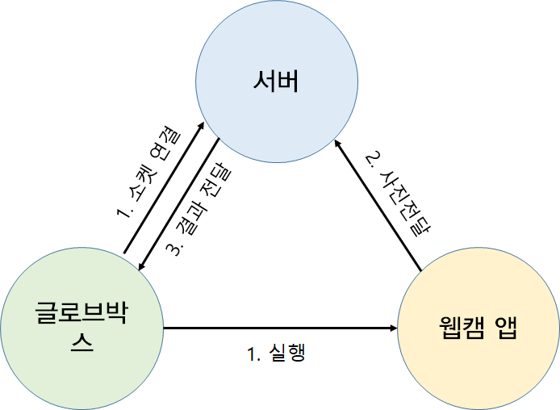
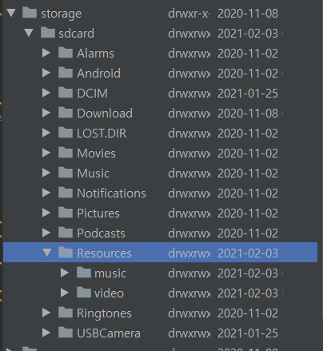
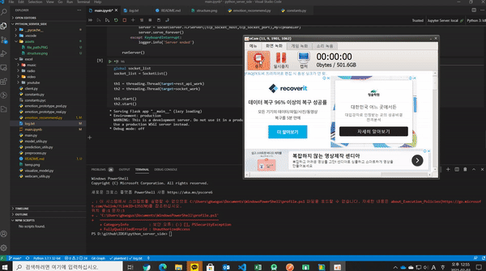

# 간단한 설명

## 동작 구조



- 서버는 REST API와 TCP 두 가지 방식으로 돌아가고 있음 (이중구조)

1. 글로브박스 SW에서 웹캠 앱 실행 (com.jiangdg.usbcamera) 및 서버와 TCP 연결

2. 웹캠 앱에서 사진 촬영

3. 서버로 사진 송신 (REST API를 통해)

4. 서버는 사진을 분석해서 결과를 TCP 소켓으로 글로브박스 SW에 전달

5. 웹캠 앱 종료 및 글로브박스 SW 복귀

## REST API

- HOST : `localhost`
  
- PORT : `5000`

- `GET /wakeup`
  
  > 서버 가동 여부를 반환

  - 결과 예시

    ```python
    {
    "status": "open"
    }
    ```

- `POST /emotion`
  
  > 웹캠 앱에서 전달받은 사진의 감정 분석 결과를 반환

  - Body
  
    ```python
    {
        "image": (base64 인코딩 이미지)
    }
    ```

    - 예시

       ```python
       {
           "image":"iVBORw0KGgoAAAANSUhEUgAAAtIAAANYCAYAAADpNgqgAAAABG"
       }
       ```

  - 결과 예시

    ```python
    {
        "analysis_result": "Happy"
    }
    ```

- `POST /recommend`

  > 웹캠 앱에서 전달받은 사진의 감정 분석 결과와 추천 리스트를 반환

  - Body [(리소스 저장 경로란?)](#경로)
  
    ```python
    {
        "path": (리소스 저장 경로)
        "image": (base64 인코딩 이미지)
    }
    ```

    - 예시

       ```python
       { 
           "path:":"/storage/sdcard/Resources",
           "image":"iVBORw0KGgoAAAANSUhEUgAAAtIAAANYCAYAAADpNgqgAAAABG"
       }
       ```

  - 결과 예시

    ```python
    {
    "analysis_result": "Happy",
    "header": "EMOTIONAL_STATE",
    "recommended_list": {
        "music": [
            "/sdcard/music/crush_1.mp3",
            "/sdcard/music/iu_2.mp3",
            "/sdcard/music/mamamoo_1.mp3"
        ],
        "radio": [
            "http://fmbook.ebs.co.kr/fmbook/live_m4a/playlist.m3u8",
            "http://radio.kfm.co.kr:8000/",
            "http://218.157.19.198:8000"
        ],
        "video": [
            "/sdcard/video/bol4_2.mp4",
            "/sdcard/video/bol4_3.mp4",
            "/sdcard/video/bol4_1.mp4"
        ],
        "youtube": [
            "https://www.youtube.com/watch?v=SqPVMqamjSk",
            "https://www.youtube.com/watch?v=VN4EusA9zmE",
            "https://www.youtube.com/watch?v=pHtxTSiPh5I"
        ]
    }
    }
    ```

## TCP/IP Socket

- HOST : `localhost`
  
- PORT : `6000`

- 예시 클라이언트 코드 : [client.py](./client.py)

## 경로

- 음악, 비디오 파일 저장 경로

  - ROOT_PATH/Resources/(music, video)/(파일명)

    

## 동작 영상


